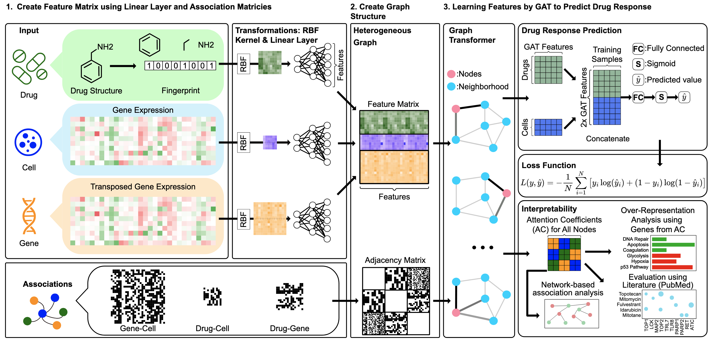

# drGAT

This is the official implementation of **drGAT: Attention-Guided Gene Assessment for Drug Response in Drug-Cell-Gene Heterogeneous Network**

[](https://arxiv.org/abs/2405.08979)



The model utilizes attention-based GNN model (e.g., GAT, GATv2, and Transformer) to analyze a heterogeneous network comprising drugs, cells, and genes.\
It predicts drug sensitivity and identifies gene-level contributions via attention mechanisms.

---

## 🚀 Quick Start (with [uv](https://github.com/astral-sh/uv))

> Requires: Python 3.10 or 3.11

1. Clone the repository:

   ```bash
   git clone https://github.com/inoue0426/drGAT.git
   cd drGAT
   ```

2. Run the prediction script (CPU or GPU):

   ```bash
   chmod +x run_drGAT.py
   ./run_drGAT.py --task test2 --data nci --method GATv2 --cell_or_drug cell
   ```

3. Example output:

   ```
   Using device: cpu
   Best model found at epoch 2
   ACC           : 0.511 (±0.009)
   Precision     : 0.215 (±0.296)
   Recall        : 0.221 (±0.438)
   F1            : 0.170 (±0.289)
   AUROC         : 0.535 (±0.024)
   AUPR          : 0.532 (±0.029)
   ```

---

## 📁 Directory Overview

```
drGAT/                 # Model core implementation
configs/               # YAML configs for hyperparameters
Test1_random_split/    # Experiment scripts for random masking
Test2_leave_X_out/     # Experiment scripts for leave-one-out for entire cell/drug
preprocess/            # Data wrangling notebooks
data/                  # Preprocessed input data
```

---

## 📦 Dependencies

This project supports two ways of managing dependencies:

- `uv` script headers for lightweight reproducibility
- `pyproject.toml` for standard Python project environments

### 🌀 Option 1: Using [`uv`](https://github.com/astral-sh/uv)

This method enables quick, isolated script execution with dependencies declared directly in your Python script.

```python
#!/usr/bin/env -S uv run --script
# /// script
# requires-python = ">=3.9, <3.12"
# dependencies = [
#     "numpy<2",
#     "pandas",
#     "torch",
#     "torch-geometric",
#     "scikit-learn",
#     "tqdm",
#     "pubchempy",
#     "seaborn",
#     "pyyaml",
#     "packaging",
#     "rdkit-pypi"
# ]
# ///
```

#### ✅ Setup & Run

```bash
# Install uv (if not yet installed)
pip install uv

# Run your script
./run_drGAT.py
```

> Great for reproducible environments and one-file scripts.

### 🧰 Option 2: Using `pyproject.toml`

If you prefer a standard project-based setup with pip, use the following:

```toml
[project]
name = "drgat"
version = "0.1.0"
description = "Drug response prediction with Graph Transformer"
requires-python = ">=3.9"

dependencies = [
    "numpy",
    "pandas",
    "scipy",
    "torch>=2.0",
    "torchvision",
    "torch-geometric",
    "scikit-learn",
    "tqdm",
    "rdkit",
    "pubchempy",
    "pyyaml",
    "packaging",
    "seaborn"
]
```

#### ✅ Install via pip

```bash
# (Optional) Create and activate virtual environment
python -m venv .venv
source .venv/bin/activate  # or .venv\Scripts\activate on Windows

# Install dependencies
pip install .
```

> Choose whichever workflow fits your development or deployment needs. If unsure, start with `uv` for prototyping.

---

## 📖 Citation

```bibtex
@article{inoue2024drgat,
  title={drGAT: Attention-Guided Gene Assessment of Drug Response Utilizing a Drug-Cell-Gene Heterogeneous Network},
  author={Inoue, Yoshitaka and Lee, Hunmin and Fu, Tianfan and Luna, Augustin},
  journal={arXiv preprint arXiv:2405.08979},
  year={2024}
}
```
